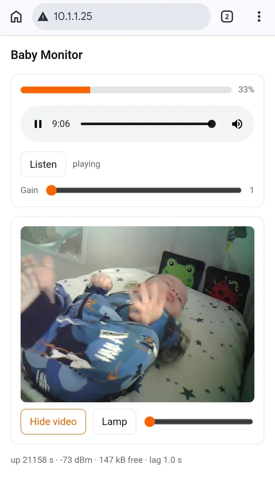
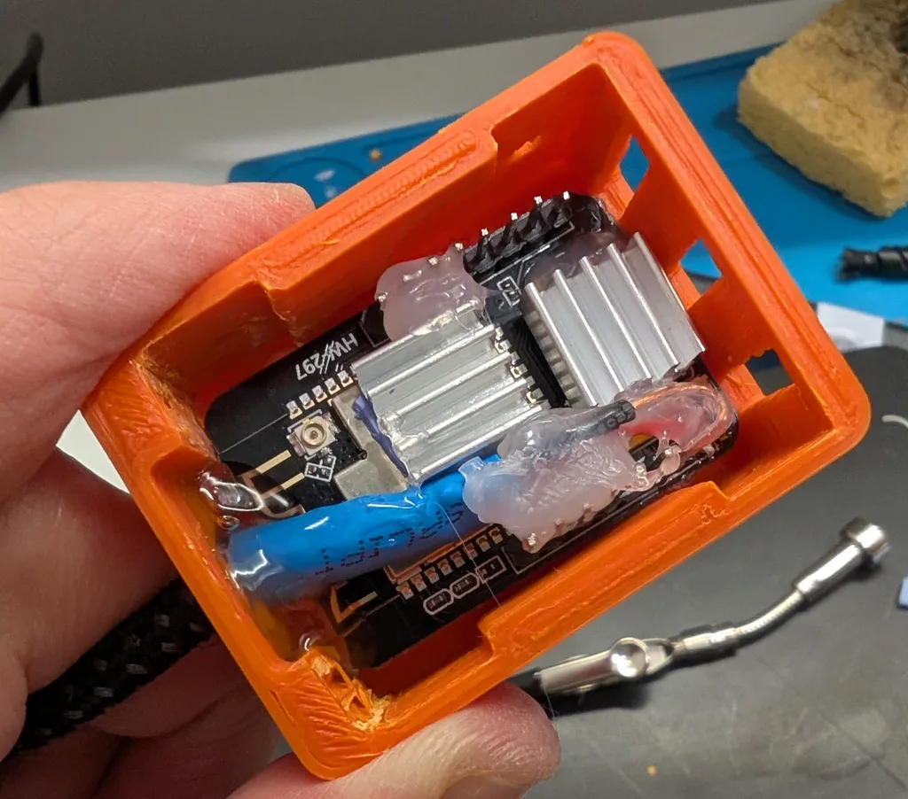
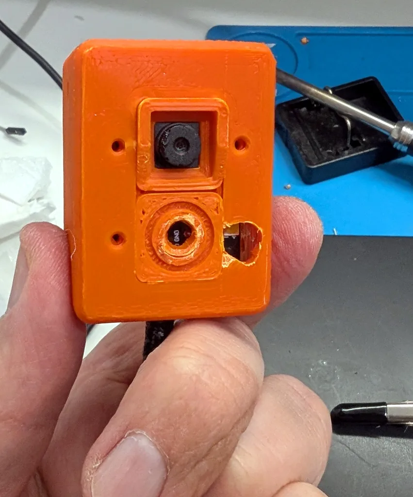
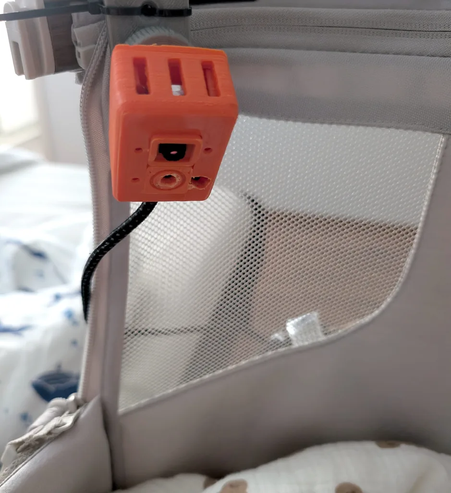

# baby_camera

A baby monitor built from an AI-Thinker ESP32-CAM and a €2 I2S microphone.
Video and **sound**, in a printed case, on your own network, talking to nobody
else's server.

The point of this repository is not the code — it is short — but the half-dozen
things that silently do not work the way the tutorials say they do. Every one
of them cost an evening. They are all written down below.



## What it does

| endpoint | what |
|---|---|
| `http://babycam/` | page: level meter, audio player, video toggle, lamp |
| `http://babycam:81/stream` | MJPEG video, only while somebody is watching |
| `http://babycam:82/audio` | endless WAV, running at all times |
| `http://babycam/level` | JSON: level, gain, uptime, RSSI, heap, diagnostics |
| `http://babycam/set?gain=N&lamp=N&chan=N&shift=N` | live tuning, no reflash |

Audio and video are **two independent streams**, on purpose. MJPEG cannot carry
sound at all — it is just concatenated JPEGs — and a baby monitor does not need
lip sync. It needs to be heard. Keeping them apart also means a stalled video
connection can never silence the microphone, and lets the ESP32's two cores each
do one job.

Sound runs continuously; video is off until you ask for it. You glance at the
picture occasionally and listen constantly, so the expensive stream is the one
that should be optional.

## Hardware

* **AI-Thinker ESP32-CAM** (sold with the marking `HW-297`, among others)
* **OV2640** camera, the standard 8×8 mm module
* **INMP441** I2S microphone module — pins labelled `GND VDD SO L/R WS SCK`.
  Sold both as the familiar rectangular breakout and as a small round board
  (marked `441` on the die); the pad names are identical on both.
* 5 V supply worth the name (see below)



The two heatsinks are not decorative. The board runs warm on a continuous
stream, which is also why the vented shell is the one to print.

### Wiring

| microphone | ESP32-CAM |
|---|---|
| `VDD` | **3V3** — not 5V, it is a 3.3 V part |
| `GND` | GND |
| `SCK` | IO14 |
| `WS` | IO15 |
| `SO` | **IO13** |
| `L/R` | GND |

Go by the **labels printed on the board**, not by counting pins: the header
order is not numerically sequential and counting is how you end up on the wrong
one.

`SO` must not go to **IO12**. That pin is the MTDI strap and sets the flash
voltage at reset; `SO` is driven by the microphone, so if it happens to be high
at power-up the board will not boot at all. IO13 has no strapping role.

IO13/14/15 belong to the microSD slot. The firmware never initialises the card,
so they are free. A live stream has no use for it.

## Six things that are not in the tutorials

**1. `ONLY_LEFT` is not the left channel.** With `L/R` tied to GND the datasheet
says the microphone speaks in the left slot, so `I2S_CHANNEL_FMT_ONLY_LEFT` is
the obvious choice. On the ESP32 receiver it yields a flat, perfect zero —
indistinguishable from an unconnected microphone. Use **`ONLY_RIGHT`**.

**2. The 24-bit sample is not left-justified.** Example code everywhere shifts
the 32-bit slot right by 16, assuming the data sits at the top. On this part it
sits in the low 24 bits, so the correct shift is **8**. Get this wrong and the
signal is real but three-quarters thrown away, quiet enough to look broken.

**3. The camera owns I2S0.** The `esp32-camera` driver uses it to clock the
parallel DVP bus. That is why so many people conclude sound is impossible on an
ESP32-CAM. The chip has two I2S blocks — put the microphone on **I2S1** and
nothing collides.

**4. `lru_purge_enable` is not optional.** `esp_http_server` has a socket limit.
Reach it and the server goes on *accepting* connections and closing them with no
response whatsoever: every endpoint looks stone dead while the board still
answers pings perfectly. Two forgotten browser tabs are enough. With LRU purge
on, old sockets are evicted and access is never lost.

**5. `<audio>` has no idea what "live" means.** It plays everything it received,
in order, and discards nothing. One network hiccup that later arrives as a burst
becomes *permanent* delay — an hour in, you are listening to twenty minutes ago.
The page therefore measures the gap between buffered and playing, shows it, and
jumps forward when it exceeds 1.5 s. On the device side the ring buffer **drops**
samples instead of queueing them, which is what bounds latency there. For a baby
monitor a momentary gap beats stale audio every time.

**6. A WAV header of `0xFFFFFFFF` stops some browsers.** It is the conventional
lie for an endless stream, but several browsers read it as −1, keep downloading
and never start decoding. `0x7FFFFFFF` is a lie they believe. And autoplay is
blocked until the page is interacted with, so there is an explicit Listen button
and a status line — a blocked stream must not look like a broken one.

## Powering it

The camera draws ~300 mA in bursts. A USB-serial dongle cannot supply that: the
board reboots forever with `Brownout detector was triggered` before it prints a
single line of its own. Give it 5 V from a real supply on the `5V` pin, keep the
ground common with the programmer, and add 470–1000 µF across 5V/GND at the
board.

The firmware disables the brownout detector, as is customary on these boards.
That silences *false* trips; it does nothing for a supply that genuinely sags,
and running under-volt risks corrupting flash. Fix the power, not the detector.

## Flashing

```bash
cd firmware
$EDITOR src/config.h        # your SSID and password go here
pio run -t upload
pio device monitor
```

Platform is pinned to `espressif32@6.5.0` (Arduino core 2.0.14) on purpose: it
still ships the legacy `driver/i2s.h`. Core 3.x replaced that API wholesale and
the rewrite would have to be re-verified against the camera driver for no gain.
The `huge_app` partition is required — camera plus three HTTP servers do not fit
the default app partition — which costs OTA.

### Getting into the bootloader

Hold `IO0` to GND, **then** power up. IO0 is sampled only at the rising edge of
reset, so pressing a BOOT button on a board that is already running does
nothing; that misunderstanding is the source of most "it will not flash" reports.

**A bad ESP32-CAM-MB shield fails in a way worth recognising.** Ours passed data
from the board to the PC — it happily printed the previous firmware's output —
but nothing in the other direction, and its DTR/RTS never reached EN or IO0.
esptool says only `No serial data received`, which it also says when no board is
attached at all. `tools/detect.sh` exists to tell those two apart: it listens
passively before it talks. A plain USB-UART dongle worked on the first attempt.

## Tools

```bash
tools/detect.sh            # what is on the port and which state it is in
tools/uart.sh [port] [baud]  # serial monitor; Ctrl-T timestamps, Ctrl-R reset
```

`detect.sh` distinguishes **running** (an application holds the UART),
**bootloader** (silent by design, answers SYNC) and **dead** — three states that
esptool reports with one identical error message.

## Case

Printed from [CasperJohansen's ESP32-CAM ball-joint case](https://www.thingiverse.com/thing:6106534)
(CC BY), which needs no supports and no modification. Parts used:

* `ESP32Cam-Caseantennahole+3vents.stl` — three vents matter, the board runs warm
  on a continuous stream
* `ESP32Cam-LensAdapter8x8module+smiley.stl` — for the stock 8×8 camera
* `ESP32Cam-MountingKit.stl` — wall plate, ball and knurled nut, if you are
  mounting to a wall or a shelf

Screws: 4× M2.5×4, 4× M2.5×5, 2× M2×5.




How it hangs is a question about your cot, not about this project. The ball
mount from the kit suits a wall; the one in the photo is a printed bracket and
two cable ties on the rail, aimed down into the cot.

Printed in HIPS for the case and SBS for the ball joint — the joint holds its
angle by friction and wants a plastic with some give. PLA is a poor choice for
anything that sits around a board that warms itself.

The vents double as the sound port, so no extra hole is needed. Note that the
INMP441 listens through a hole on its **underside**: glue that face to a wall and
it goes deaf.

## Limits

**One listener at a time.** The microphone task feeds a single ring buffer and
reading from it is destructive, so two listeners tear the stream between them —
not "the second one fails", but *both* get shredded. Two browser tabs on one
machine is enough to do it. Supporting several would mean a buffer per
connection; for one phone it is not worth it.

**No recording.** Two unsynchronised streams are fine for listening and hopeless
for making a file you can watch later. That would mean RTSP, which on the
original ESP32 is a different project.

**No encryption, no authentication.** Anybody on your LAN can watch and listen.
Do not port-forward it.

## Licence

MIT for this code. The case model is CC BY by CasperJohansen — attribution is
above and stays there.
